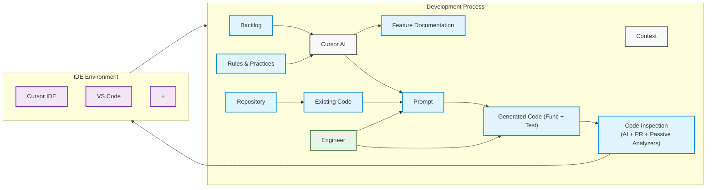

# Developer Workflow

This document outlines the AI-powered developer workflow using Cursor IDE.

## Workflow Description

1. **Input Sources**
   - Backlog items
   - Rules and practices
   - Existing codebase
   - Feature documentation

2. **AI Processing**
   - Cursor AI processes inputs to generate:
     - Feature documentation
     - Implementation prompts
     - Code and tests

3. **Development**
   - Engineer reviews and provides feedback
   - Code inspection (AI + PR + Passive Analyzers)
   - Integration with IDE environment (Cursor + VS Code)

4. **Output**
   - Generated code and tests
   - Updated documentation
   - Code inspection results

## Key Components

- **Cursor AI**: Central AI processing engine
- **IDE Environment**: Development tools (Cursor + VS Code)
- **Code Inspection**: Automated and manual code review process
- **Repository**: Version control and code storage
- **Engineer**: Human developer providing oversight and feedback 